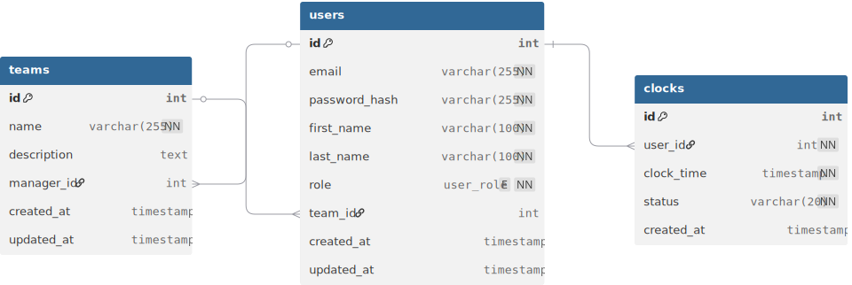

# Structure Base de Données

## Tables

### users
| Colonne | Type | Description |
|---------|------|-------------|
| id | SERIAL | PK |
| email | VARCHAR(255) | UNIQUE, NOT NULL |
| password_hash | VARCHAR(255) | NOT NULL |
| first_name | VARCHAR(100) | NOT NULL |
| last_name | VARCHAR(100) | NOT NULL |
| role | VARCHAR(50) | 'Manager' ou 'Employé' |
| team_id | INTEGER | FK → teams(id) |
| created_at | TIMESTAMP | Auto |
| updated_at | TIMESTAMP | Auto |

**Index**: email, team_id

### teams
| Colonne | Type | Description |
|---------|------|-------------|
| id | SERIAL | PK |
| name | VARCHAR(255) | NOT NULL |
| description | TEXT | NULL |
| manager_id | INTEGER | FK → users(id) |
| created_at | TIMESTAMP | Auto |
| updated_at | TIMESTAMP | Auto |

**Index**: manager_id

### clocks
| Colonne | Type | Description |
|---------|------|-------------|
| id | SERIAL | PK |
| user_id | INTEGER | FK → users(id) |
| clock_time | TIMESTAMP | NOT NULL |
| status | VARCHAR(20) | 'check-in' ou 'check-out' |
| created_at | TIMESTAMP | Auto |

**Index**: user_id, clock_time

## Relations



```
users.team_id → teams.id (Many-to-One)
teams.manager_id → users.id (One-to-One)
clocks.user_id → users.id (Many-to-One)
```

**Important**: Le manager fait partie de son équipe :
- `users[manager].team_id` = équipe qu'il manage
- `teams[equipe].manager_id` = ce manager

## Données Test

### Managers
- manager1@timemanager.com (Équipe Dev, id=1)
- manager2@timemanager.com (Équipe Marketing, id=2)
- manager3@timemanager.com (Équipe Support, id=3)

### Employés
- dev1-3@timemanager.com (Équipe 1)
- marketing1-2@timemanager.com (Équipe 2)
- support1-3@timemanager.com (Équipe 3)

Tous les mots de passe: **password123**
